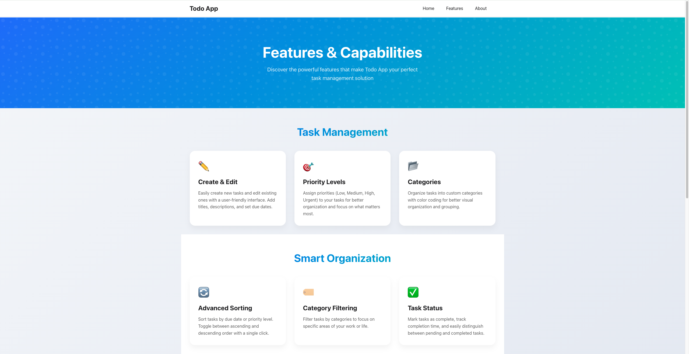
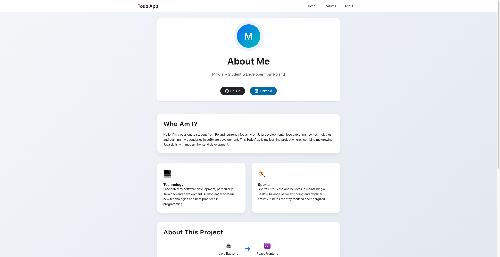
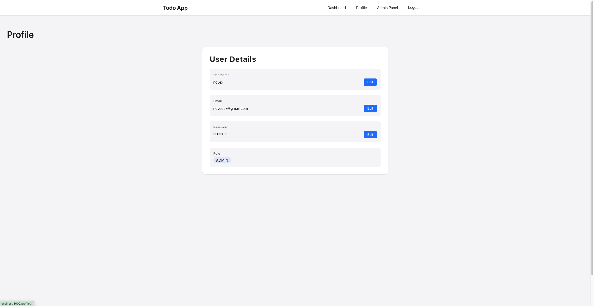
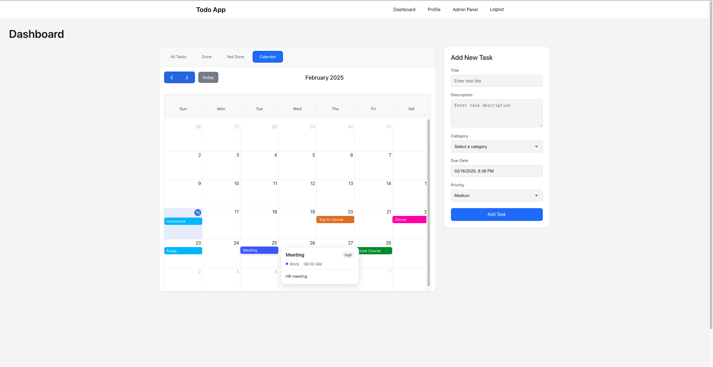

# Basic Todo App

A simple task management application designed to help users organize and manage their daily tasks. The **backend** is built using **Java** and the **Spring Framework**, while the **frontend** was created as a fun experiment using AI tools.

---

## Features

### Backend
- Developed with **Java** and **Spring Boot**.
- Multi-module project
- Secure user authentication system:
  - User registration and login using **JWT (JSON Web Tokens)**.
  - Bearer token-based authentication for API security.
- RESTful API endpoints for task management:
  - Create, update, delete, and retrieve tasks.

### Frontend
- Built with **React** as a learning exercise using AI tools.
- Simple and clean user interface:
  - Add, edit, delete, and view tasks.
  - Organize tasks by priority and category.

---

## Screenshots

### Welcome Page

### Dashboard

### Features Page

### About page

### Profile

### Calendar with popup

---
